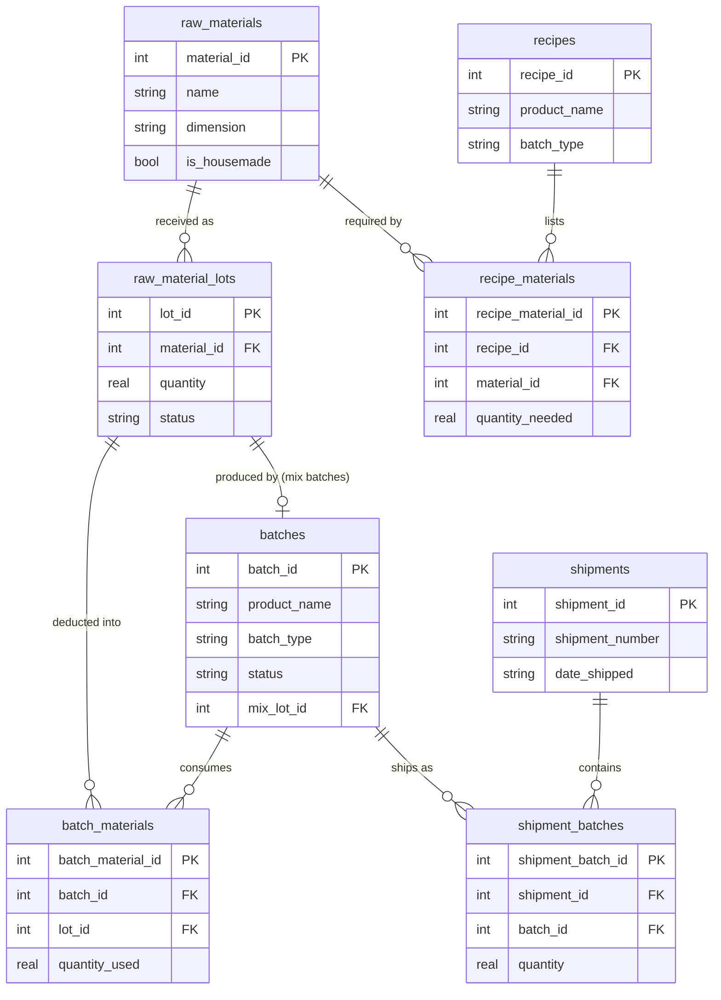
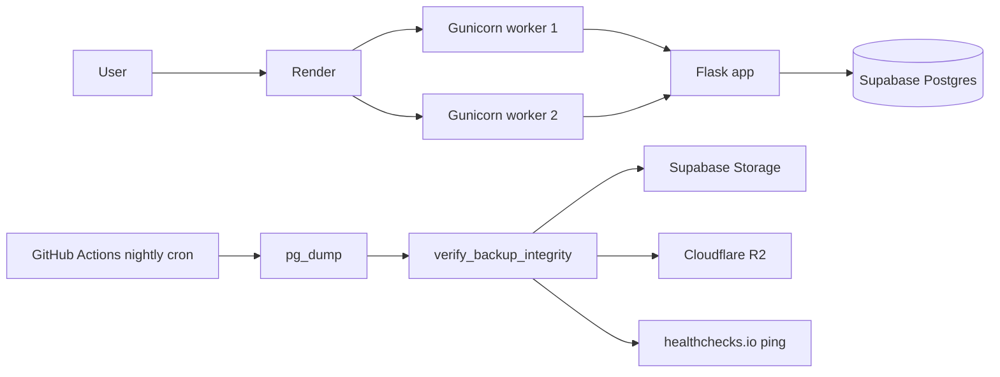

# Botaniks Inventory Management System
Lot-based inventory and production tracking for a small matcha manufacturer.
<!-- One-line tagline under the title, e.g. "Lot-based inventory & production tracking for a matcha manufacturer." -->

**Stack:** Python, Flask, Gunicorn · PostgreSQL (prod) / SQLite (dev, test) · pandas, openpyxl · Jinja2, HTML/CSS, JavaScript · pytest, Hypothesis · Docker, GitHub Actions, Render, Supabase, Cloudflare R2

I started as a warehouse employee at Botaniks Herbs & Tea, a Santa Cruz matcha and tea wholesaler, where inventory was tracked in spreadsheets and by intuition. That caused daily material shortages, manual physical counts, and hand-checked batch details. I built a demo database, pitched it to the owner, and the company moved me off warehouse work to build it during paid hours, as the sole engineer. It replaced manual tracking of 70+ raw materials and 45 products for the 6-person operation, and has run daily since its June 2026 launch: containerized with Docker, served on Gunicorn, saving 5-6 hrs/week with zero stockout-driven batch cancellations since launch (previously every 1-2 months). Clients take 350kg+ pallets weekly.

## Demo

<!-- TODO(aero): GIF + 3-4 screenshots (receiving a lot, FIFO batch creation, shipping) using scrubbed/seed data. Run `python scripts/seed_demo_data.py` to rebuild data/demo_inventory.db, then serve it on a second port (see the script's docstring) and screenshot from there. Never real inventory, costs, or supplier data. -->

## Features

- **Track raw materials by lot, not just a total number.** Every receipt gets its own lot with its own quantity, cost, and expiration date, so stock on hand is always traceable back to exactly what came in and when.
- **Build batches two ways: FIFO or pick-your-own.** Making a batch pulls from the oldest lot first by default, but staff can manually choose which lots to draw from when it matters.
- **Plan batches ahead of time.** Schedule a batch for a future completion date and the system holds off deducting materials until then, promoting it to "Ready" automatically once the date hits and stock allows.
- **Make house-made intermediate products.** "Mix" batches become their own trackable material, so a finished batch can consume something made in-house just like a purchased ingredient.
- **See low-stock problems before they're a problem.** The dashboard flags materials at or below their reorder level.
- **Log shipments and get an audit trail for free.** Every batch, lot, and shipment action is logged automatically, and anything can be exported to Excel.
- **Convert units at the edges, store one base unit.** Receipts can be entered in lb, oz, or kg; everything is converted to grams once on input and stored at full precision. See [Engineering highlights](#engineering-highlights).
- **Define recipes per product.** Each recipe lists the materials and quantities a batch needs, and batch creation checks coverage against live lot stock before deducting.
- **Edit or delete a batch without losing the materials it drew.** Deleting a batch can reallocate its consumed lots back to stock instead of just orphaning the deduction.

## Architecture

### Schema

<!-- ER diagram of the core schema: materials/lots, recipes, batches, and shipments -->

Column types below are the SQLite dev/test schema (`services/setup.py`). Production Postgres (`init_db.py`) differs: `raw_material_lots.quantity` and `recipe_materials.quantity_needed` are `NUMERIC`; `batch_materials.quantity_used` and `shipment_batches.quantity` are `DOUBLE PRECISION`. See [Engineering Decisions #2](docs/engineering-decisions.md#2-the-floatdecimal-bug-and-the-units-layer).

### System

Two independent flows: the live app, and the nightly backup pipeline.

Two Gunicorn workers are why the promotion race in [Engineering Decisions #1](docs/engineering-decisions.md#1-the-double-deduction-race-and-the-conditional-update-fix) is possible at all: both can reach the same page-load trigger at once.

## Engineering highlights

- **A page-load promotion race that silently double-deducted stock, fixed with a conditional `UPDATE ... WHERE status='Planned'` claim instead of an engine-specific row lock.** [Read more →](docs/engineering-decisions.md#1-the-double-deduction-race-and-the-conditional-update-fix)
- **A float/Decimal bug where two equal quantities failed a stock-coverage check**, fixed with one base unit, `Decimal` conversion math, and a shared tolerance instead of per-callsite epsilons. [Read more →](docs/engineering-decisions.md#2-the-floatdecimal-bug-and-the-units-layer)
- **Stock is a derived `SUM` over lots, not a stored counter**, so FIFO, per-lot expiry, and auditable per-batch cost all fall out of one source of truth instead of a value that can drift. [Read more →](docs/engineering-decisions.md#3-lot-based-stock-as-a-derived-sum)
- **Backups are verified before they count as a backup.** `pg_dump` exiting 0 doesn't mean the data made it in, so every dump is checked for size, schema, and row content, mirrored to a second vendor, and watched by a dead-man's-switch ping. [Read more →](docs/engineering-decisions.md#4-verified-backups-with-an-off-site-copy)
- **Three N+1 query patterns collapsed into single batched queries**, cutting a 10-ingredient recipe check from 11 database connections to 1. [Read more →](docs/engineering-decisions.md#5-n1-query-elimination)

## Testing & Reliability

211 tests across 8 files in `test_scripts/` (pytest + Hypothesis), run against an isolated throwaway SQLite database that's rebuilt per session and wiped between tests. It never touches `data/inventory.db` or production. Hypothesis property tests guard the unit-conversion layer (round-tripping, unit aliases, the float-storage boundary) against classes of error rather than hand-picked values. The double-promotion race is reproduced deterministically by replaying a captured post-race snapshot rather than racing real threads; see [Engineering Decisions #1](docs/engineering-decisions.md#1-the-double-deduction-race-and-the-conditional-update-fix) for how.

The suite runs on SQLite; production runs Postgres. It verifies application logic, not Postgres-specific behavior (`Decimal` return types, `LASTVAL()`, the connection pool). There is no database-matched CI. The real gate is a local pre-push hook (`git config core.hooksPath hooks`) that blocks `git push` if pytest or an app-boot smoke test fails; a GitHub Actions workflow re-runs the suite on push/PR as an async backstop, since Render deploys on push with nothing else in between.

## Known limitations

- **Promotion runs on page load, not a schedule.** A Planned batch is only checked when someone loads a page that calls `promote_planned_batches()`; the double-deduction race is fixed, but a batch can still sit past its due date if nobody visits. A real repair pass (`scripts/repair_double_promotion.py`) fixed batches already corrupted before the fix shipped. **Next:** a scheduled trigger, e.g. a GitHub Actions cron hitting an internal endpoint.
- **Tests run on SQLite; production runs Postgres.** No database-matched CI, so a Postgres-specific bug could only surface in production. **Next:** a Postgres service container in CI.
- **One shared login, and an audit log that can't name names.** All six staff share one HTTP Basic Auth credential; `audit_log` records what happened, not who did it. **Next:** per-user accounts and a `user_id` column on every audit row.
- **Backup verification checks shape, not restorability.** Automated checks catch an empty, truncated, or schema-only dump; a full restore has only been tested by hand (most recently 2026-10-03). **Next:** a scheduled restore drill in CI.
- **No response security headers yet** (CSP, X-Frame-Options, HSTS). Every route is behind `@requires_auth`, but header hardening is still open.
- **The UI has design-system debt.** Formatting helpers (`fmt_num`, `dash`, `humanize`, `fmt_date`) exist but aren't wired into most templates, and some status colors are hardcoded instead of using the shared CSS tokens.

## Docs

- [Engineering Decisions](docs/engineering-decisions.md): the promotion race, the units layer, derived stock, verified backups, and N+1 elimination, each with the full reasoning behind it.
