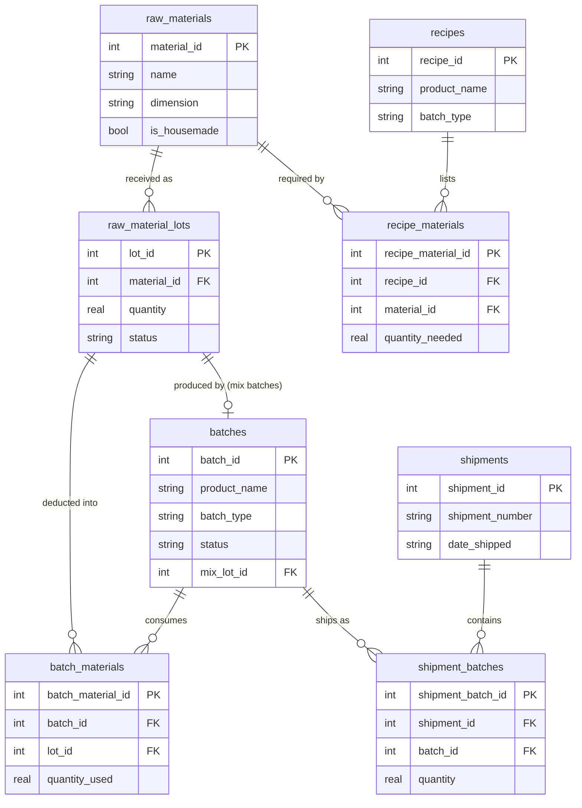

# Botaniks Inventory Managment System 

<!-- One-line tagline under the title, e.g. "Lot-based inventory & production tracking for a matcha manufacturer." -->

<!-- Badge/tag row — e.g. shields.io badges or plain text: Flask · PostgreSQL · SQLite · Supply Chain · Render -->

## Table of Contents

- [Overview](#overview)
- [Demo](#demo)
- [Features](#features)
- [Architecture](#architecture)
- [Engineering Decisions](#engineering-decisions)
- [Testing & Reliability](#testing--reliability)
- [Known Limitations & Next Steps](#known-limitations--next-steps)

## Overview

### What it is:

Botaniks is an inventory management system for a Santa Cruz matcha and tea wholesaler (Botaniks Herbs & Tea). It tracks raw materials by lot, plans and records production batches deducted from user-selected lots or automatic FIFO, and logs shipments, giving warehouse and management staff exact stock levels, recipes, and batch and shipment history. It has been in production since June 2026 and is used daily by six staff.

**Stack:**

| Layer | Tools |
|---|---|
| Backend | Python, Flask, Gunicorn |
| Data | PostgreSQL (prod), SQLite (dev/test), pandas, openpyxl (Excel export) |
| Frontend | Jinja2 templates, HTML/CSS, JavaScript |
| Testing | pytest, Hypothesis |
| Infra | Docker, GitHub Actions, Render, Supabase, Cloudflare R2 |

### Background:

I started as a warehouse employee at Botaniks, where inventory was tracked in spreadsheets and by intuition. That caused daily slowdowns: unexpected material shortages, manual physical counts of batches ready to ship, and batch details that had to be checked by hand.

I built a demo database system and pitched it to the owner. After a positive response I kept building it on the side, and eventually the company moved me off warehouse work to build it during paid hours.

## Demo
 
<!-- GIF or 3-4 screenshots: receiving a lot, FIFO batch creation, shipping. Use scrubbed data. -->

## Features

- **Track raw materials by lot, not just a total number.** Every receipt (a bag of matcha, a box of tins) gets its own lot with its own quantity, cost, and expiration date, so stock on hand is always traceable back to exactly what came in and when.
- **Build batches two ways: FIFO or pick-your-own.** Making a batch pulls from the oldest lot first by default, but staff can manually choose which lots to draw from when it matters (e.g. using up a lot that's expiring soon).
- **Plan batches ahead of time.** Schedule a batch for a future completion date and the system holds off deducting materials until then — it automatically promotes the batch to "Ready" when the date hits, as long as there's enough stock.
- **Make house-made intermediate products.** "Mix" batches (like a blended base) become their own trackable material, so a finished batch can consume something you made in-house just like any purchased ingredient.
- **See low-stock problems before they're a problem.** The dashboard flags materials sitting at or below their reorder level, so the person managing inventory doesn't find out by running out mid-batch.
- **Log shipments and get an audit trail for free.** Every batch, lot, and shipment action is logged automatically, and anything can be exported to Excel for bookkeeping or a quick look outside the app.

## Architecture

### Schema

<!-- ER diagram of the core schema: materials/lots, recipes, batches, and shipments -->

## Engineering Decisions

<!-- 4-5 entries, each: Problem → What went wrong → Fix → Why this over the alternative -->

### 1. The double-deduction race and the conditional UPDATE fix

**Problem:** A Planned batch is scheduled for a future date, and its materials are deducted from stock when that date arrives. There is no background worker. `get_batches()` and `get_all_batches_with_id()` call `promote_planned_batches()` on page load, throttled by a 60-second timer. Production runs two Gunicorn workers, which are separate OS processes, so two requests can reach that function at the same instant and both see the same overdue batch.

**What went wrong:** The function found overdue batches with a plain `SELECT`, deducted each batch's lots, then flipped its status with `UPDATE ... WHERE batch_id = %s`. A `SELECT` takes no lock and the UPDATE didn't re-check anything, so both requests read `status = 'Planned'` and both ran the full deduction. The damage was twofold:
- **Double deduction:** duplicate `batch_materials` rows, with the same lots drawn down twice.
- **Phantom stock:** for mix (Component) batches, a duplicate house-made output lot.

The duplicates reached real data, so I wrote `scripts/repair_double_promotion.py` (dry-run by default) to find and fix both kinds.

**Fix:** The status flip became a conditional claim (`_claim_batch` in `services/batches.py`):

`UPDATE batches SET status='Ready' ... WHERE batch_id=%s AND status='Planned'`

- **It runs first.** It is the first statement in that batch's own transaction, so every other write for the batch happens after the claim succeeds.
- **Only one caller wins.** An UPDATE must take a write lock, so concurrent claims run one at a time. The second re-evaluates `status = 'Planned'` against committed data, finds `Ready`, matches zero rows, and the code skips the batch.
- **Failures release the claim.** If a later step fails (e.g. insufficient stock), the rollback undoes the claim and the batch stays Planned with a failure reason recorded.
- **One transaction per batch.** One batch failing can't roll back others already promoted in the same pass.

This works the same on SQLite (database-wide write lock) and Postgres (row lock).

**Why this over the alternative:**
- **`SELECT ... FOR UPDATE [SKIP LOCKED]`** is Postgres-only. Using it alone would leave the SQLite-backed test suite unprotected and mean maintaining two concurrency mechanisms and trusting they're equivalent. The conditional UPDATE uses no engine-specific syntax, so one piece of logic is correct everywhere. It's kept there as a throughput optimization so workers pick different batches, not as the correctness mechanism.
- **A scheduled promotion job** would remove the page-load trigger but still needs the guard once two workers or a retry overlap.
- **Testing without threads:** the suite replays a stale pre-commit snapshot of the overdue batch through a second promotion run and asserts nothing is deducted twice and no duplicate lot exists. It reproduces the state a race leaves behind, not the timing, so it never flakes.

**Known limitation:** Promotion only happens when someone loads a page, and the 60-second throttle is a per-process global, so the two workers don't coordinate. Correctness is safe because of the claim, but a batch could sit past its due date if nobody visits. The fix is a real scheduled trigger, such as a GitHub Actions cron hitting an internal endpoint, like the backup job.

---

### 2. The float/Decimal bug and the units layer

**Problem:** Quantities are entered in what ever unit of measument is natural for the receipt (pounds, ounces, kilograms, etc) but need to be stored, summed and compared against the recipes required quantity consistently. Doing this using plain floats meant converting through binary floating point, which cant represent most of these conversions exactly. 

**What went wrong:** A house-made mix lot holding exactly 176 lb was rejected as insufficient for a batch needing exactly 176 lb. The lot's produced quantity had been rounded to 4 decimal places (in grams) when saved, which shifted it about 0.00002 g from the exact value. The "is there enough stock" check used a 1e-6 g tolerance, smaller than that gap, so identical quantities failed the comparison.

**Fix:**  Four pieces working together:
- **One base unit per dimension** (grams for mass). Conversion happens only at the edges, form input and display, so each quantity is converted once instead of bouncing between units.
- **Decimal for conversion math**, built via `Decimal(str(x))` with exact conversion factors, so the conversion step adds no error.
- **No rounding on save.** Produced quantities are stored at full precision.
- **One shared tolerance.** Every coverage check goes through two helpers (`_covers`, `_quantities_match`) using a 1 mg epsilon, above storage noise and far below any quantity that matters. Previously, call sites had no tolerance or a too-tight one.

**Why this over the alternative:** Threading `Decimal` end-to-end and dropping the tolerance is the principled fix, and I scoped it out deliberately. Values are still cast to `float` on write to SQLite (`REAL` has no fixed-precision decimal type), so a tolerance would still be needed on that path. On PostgreSQL, quantity columns are `NUMERIC`, which closes most of that gap. The 1 mg tolerance bounds the remaining risk without a rewrite of every service function.

---

### 3. Lot-based stock as a derived SUM

**Problem:** The obvious way to model "how much of a material do we have" is a single `stock_level` column on `raw_materials`, incremented and decremented on every transaction. The business needs more than a total, though:
- **FIFO:** Draw from the oldest receipt first, because tea products expire.
- **Expiry-aware availability:** Half of a material's stock can expire next week and the rest in six months.
- **Accurate batch cost:** A batch should reflect what the specific stock it consumed actually cost, not an average.
- **Material tracing:** The materials within each batch should be able to be tracked back to specific material lots, this allows for easier tracking of possible bad batches requiring a recall.

**Why a counter fails:** A single number can't answer any of those, because it has no idea which receipt the stock came from. It's also a second copy of the truth. If any code path updates the underlying quantities but misses the total, the two disagree and nothing exists to reconcile them.

**Fix:** `raw_material_lots` holds one row per physical receipt (quantity, received date, expiration date, cost, status). `raw_materials` has no quantity or cost column at all. Stock is computed as `SUM(quantity)` over active, non-expired lots (`get_material_stock_from_lots`, `services/lots.py`). This enables three things:
- **FIFO:** order lots by `received_date` and fill from the oldest (`promote_planned_batches`).
- **Per-lot expiry:** an expired lot drops out of the SUM automatically.
- **Auditable cost:** `batch_materials` records which lot was drawn from and freezes `cost_per_unit` at deduction time, so a batch's historical cost survives later edits to the lot.

**What deriving stock costs:**
- **Query cost:** every stock question is a `SUM` over lots, not a column read. `get_all_materials` computes stock and total cost for every material in one `LEFT JOIN ... GROUP BY` query, and `raw_material_lots.material_id` is indexed.
- **The NULL trap:** with a `LEFT JOIN`, a material with no lots gets `SUM` = `NULL`, not 0, and `NULL` slips past both `== 0` and `<= reorder_level` checks, so the item would display as "In Stock." `COALESCE(SUM(...), 0)` is what prevents that.

**Why this over the alternative:** A stored total means every code path touching stock must keep it in sync forever. Deriving it means there is no second value to go stale. This doesn't make lot quantities immune to bugs (the double deduction in #1 corrupted them directly, which is why #1 needed a repair script), but it removes one layer of drift: the material-level total disagreeing with its lots. The cost is a `SUM` per read instead of an O(1) lookup, a fine trade at a small manufacturer's write volume. If reads ever dominated, I'd materialize the total and maintain it in the same transaction as the lot write, rather than going back to a free-floating counter.

---

### 4. Verified backups with an off-site copy

**Problem:** Production runs on Postgres (Supabase), so a lost or corrupted database has to be recoverable. A nightly GitHub Actions cron job runs `pg_dump` and uploads the file to Supabase Storage. That setup has four weaknesses.

**Risks in the original design:**
- **Unverified output:** `pg_dump` exits 0 even when the dump is empty or truncated. The exit code proves the process ran, not that the data made it in, so a silently empty backup would have been trusted until the day I needed to restore.
- **Single failure domain:** The only copy lived in the same Supabase project as the database. A billing problem, deleted bucket, or account issue could take out the database and its backups together.
- **Unbounded growth:** Nightly uploads with no cleanup would eventually hit the storage cap.
- **Silent scheduler failure:** GitHub disables scheduled workflows after 60 days of repo inactivity, with no failure email. The pipeline could stop running and nothing would say so.

**Fix:**
- **Verify before upload:** `verify_backup_integrity()` rejects the dump unless it clears four checks, each catching a failure the others miss:
  1. A minimum file size, which catches a trivially empty or truncated file.
  2. A minimum count of `CREATE TABLE` statements, which proves the schema made it in.
  3. The anchor tables `raw_materials` and `batches`, which prove it's the right schema. I check two structural tables instead of every table so the check doesn't need updating every time the schema changes.
  4. At least one `COPY` block, which is how `pg_dump` writes row data. A schema-only dump passes every earlier check, so this is the one that catches "right shape, zero rows."
- **Second copy at a different vendor:** The verified dump also goes to Cloudflare R2, a separate company and account from Supabase. If any of the four R2 secrets is missing while others are set, the script raises instead of silently skipping the off-site copy.
- **Retention:** Both destinations are pruned to the newest 30 backups.
- **Dead-man's switch:** A healthchecks.io ping fires last, only after every earlier step succeeds. If the ping doesn't arrive on schedule, I get alerted. That covers the case a check inside the script can't, which is the script never running at all.

**Why this over the alternative:** The lazy option was a second bucket inside the same Supabase project, which fails for the same reason as the original setup: one vendor's outage or account problem takes out both copies. Relying on GitHub's run history as proof the backup happened doesn't work either, because a disabled schedule produces no failure to look at. Only a ping that must arrive turns silence into a signal. Checking dump contents instead of just the exit code costs a few regex passes per run, which is trivial next to discovering the backups were empty during an outage.

**Known limitation:** The automated check verifies the dump's shape, not that it restores. I verified restorability manually a handful of time, the last being 2026-10-03: the latest nightly backup was restored into a throwaway local Postgres container and the app ran against it with correct data. Automating this as a scheduled restore drill (throwaway Postgres in GitHub Actions, sanity `COUNT(*)` queries) is the next step.

---

### 5. N+1 query elimination

**Problem:** A page or service function that needs related data for N items can fetch it with one query per item, which costs N+1 round-trips. Each trip pays connection and parsing overhead even when the query itself is trivial. Here, every service call opens and closes its own database connection, so the overhead is larger than usual.

**Where it showed up:**
- **`check_negative_stock`** (`services/recipes.py`) called `get_material_stock_from_lots(material_id)` once per recipe ingredient. Each call opened its own connection, so a 10-ingredient recipe cost 11 connections: one for the recipe, ten for stock lookups.
- **`add_recipe` / `update_recipe`** (`services/recipes.py`) called `get_raw_material(name)` once per ingredient being saved, the same pattern with a connection per name.
- **Inventory lot drawers** would have needed one API call per material row to populate on page load. This one was avoided by design, not fixed after the fact.

**Fix:**

| Call site | Lookups before | Lookups after |
|---|---|---|
| `check_negative_stock` | N (one stock SUM per ingredient) | 1 (`GROUP BY material_id` with an `IN (...)` clause, read into a `{material_id: stock}` dict) |
| `add_recipe` / `update_recipe` | N (one name lookup per ingredient) | 1 (`WHERE LOWER(name) IN (...)`, resolved through a dict in the loop) |
| Inventory lot drawers | N (one API call per material) | 1 (`get_active_lots_for_materials`, one `IN (...)` query grouped by `material_id` in Python) |

In each case the per-ingredient loop stays as it was. It reads from an in-memory dict instead of the database, so the code's structure is unchanged and only the round-trips drop.

**Why this over the alternative:**
- **Caching the per-item lookups** was the first option. Stock levels and material names change on every batch or lot write, so a cache needs invalidation logic to solve a problem that one batched query removes with no staleness risk.
- **Denormalizing** (storing the material name directly on `recipe_materials`) would make the lookup unnecessary, but it duplicates data that's one join away and reopens the sync-drift problem that the lot-based stock model in #3 exists to avoid.
- **One giant multi-join query** would also work, but the actual cost here is round-trips, not query complexity. A simple batched fetch plus a dict keeps the code readable.

**Known limitation:** The `IN (...)` clause grows with the number of items. That's fine for a recipe with a handful of ingredients, but it would need chunking for very large lists.

## Testing & Reliability

211 tests across 8 files in `test_scripts/` (pytest), run against an isolated throwaway SQLite database that's rebuilt once per session and wiped between tests — never `data/inventory.db`, never production.

**Example tests** cover the services layer (materials, lots, recipes, batches, shipments) and, through `test_routes.py`, HTTP/API behavior via the Flask test client — auth, CSRF, rate limiting, and the autocomplete/lot-selection JSON endpoints.

**Property-based tests** (Hypothesis, `test_units.py`) guard the unit-conversion layer — the root of the float/Decimal bug in [Engineering Decisions #2](#2-the-floatdecimal-bug-and-the-units-layer) — against classes of error instead of a handful of hand-picked values:
- Round-tripping any quantity through `to_base`/`from_base` reconstructs the original within a tight Decimal bound.
- Every unit alias (`lbs`, `pound`, `#`, ...) converts identically to its canonical key.
- Count-based units (tin, box, each...) are the identity function — they never convert.
- The float-storage boundary (what Postgres/SQLite actually persist) doesn't drift beyond a 1e-9 relative tolerance.

**Deterministic race reproduction:** the double-promotion bug in [Engineering Decisions #1](#1-the-double-deduction-race-and-the-conditional-update-fix) only happens when two Gunicorn workers interleave, which threads in a test process can't reliably force. Instead, `test_batches.py` captures the exact stale snapshot a losing racer would hold after the winning racer has already committed, then replays it through a second promotion pass and asserts nothing is deducted twice and no duplicate output lot is created. It reproduces the state the race leaves behind rather than the timing, so it exercises the real bug on every run with no flakiness.

**Pre-push gate:** `git config core.hooksPath hooks` wires in a local pre-push hook that blocks the push if the pytest suite or an app-boot smoke test (`scripts/smoke_test.py`) fails — both run against the same isolated SQLite DB. Render auto-deploys on every push with no gate of its own in between, so this is what actually stops a broken change from reaching production, not the CI below.

**CI:** a GitHub Actions workflow (`.github/workflows/tests.yml`) runs the same suite on every push/PR to `main` and `units-conversion-layer`. It's a backstop, not the primary gate — it's async and doesn't block the deploy that Render triggers on push; the pre-push hook is what runs before that push happens.

**Backup verification:** a separate nightly workflow (`.github/workflows/backup.yml`) dumps production Postgres and runs it through `verify_backup_integrity()` (file size, `CREATE TABLE` count, presence of the `raw_materials`/`batches` anchor tables, at least one `COPY` block with row data) before accepting it — see [Engineering Decisions #4](#4-verified-backups-with-an-off-site-copy). A failed or skipped dead-man's-switch ping is the alert if the job never ran at all.

**Known gap:** the suite runs entirely on SQLite; production runs Postgres. It verifies application logic — the conditional-UPDATE claim, the units layer, the N+1 fixes — not Postgres-specific behavior like `Decimal` return types, `LASTVAL()`, or the connection pool. There is no database-matched CI; the suite is run locally before every deploy via the pre-push hook.

## Known Limitations & Next Steps

<!-- Be honest: lazy promotion trigger, SQLite-vs-Postgres test fidelity, shared auth. -->

- 
- 
- 
</content>
</invoke>
